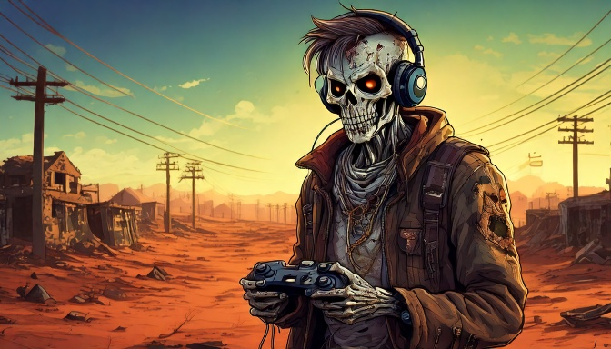
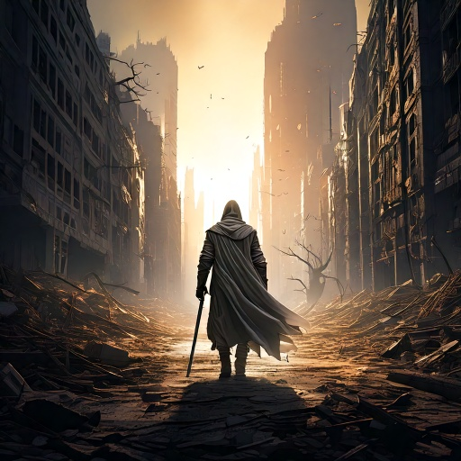

  

# Hi there, I'm Travis Ashcraft! 

## About Me

- **Role**: Gameplay Programmer 🕹️, Production Specialist @ TSTC (2+ years)
- **Expertise**: Unreal Engine (C++ & Blueprints) 🏆, Networking (AWS GameLift, EOS) 🌐, Game Mechanics 🛠️, GitHub & Source Control 🗃️
- **Known For**: Shipped titles like [Xio Survival](https://store.steampowered.com/app/1736680/Xio_Survival/), Niftyville, Polker IO, Omniscape
- **Up & Coming**: **[DAWN: Darkness Awaits](https://store.steampowered.com/app/1938500/DAWN_Darkness_Awaits_Withstand_the_Night/)** 🧟
- **Passions**: Building immersive worlds 🌌, optimizing multiplayer performance 🚀, and leading teams to code victory ⚔️

---
## The Epic of Travis Ashcraft

  

> In the realm where digital dreams are forged,  
> Where code and creativity are seamlessly merged,  
> A hero arose with a mission so grand,  
> **Travis Ashcraft**, master of the digital land.
>
> With C++ as his sword and Unreal his domain,  
> He waged epic battles on virtual plains.  
> From the first spark of code to the final polished frame,  
> He built universes that would etch his name.
>
> At **Transmira Inc**, as lead of the code-bound band,  
> He architected worlds with a visionary hand;  
> Multiplayer realms, backend dreams all aligned—  
> A maestro of systems, his brilliance enshrined.
>
> But his journey did not end in the studios alone;  
> For in Texas, at **TSTC**, his production skills shone.  
> Two years as a specialist, where discipline meets art,  
> He balanced the chaos with precision and heart.
>
> In the crucible of challenges, where physics and math reside,  
> He harnessed the power of algorithms as his guide.  
> Through the corridors of GitHub and endless version streams,  
> He forged digital sagas from imagination’s dreams.
>
> From shipped titles like **Xio Survival** to **Niftyville**’s lore,  
> **Polker IO** and **Omniscape**—each a tale to explore—  
> Yet new horizons beckon where destiny awaits,  
> **DAWN: Darkness Awaits**—the next saga he creates.
>
> So let this epic be a beacon to those who dare create,  
> A call to arms for dreamers who challenge the fate.  
> For **Travis Ashcraft** stands—a titan in the code’s embrace,  
> An enduring legend in the ever-evolving digital space.

---

## Quick Stats

  
  
  

  <!-- GitHub Readme Stats (Replace `YourGitHubUsername` with your actual GitHub username) -->
  
  

---

## Connect with Me

 

Feel free to explore my repositories for more game dev adventures, code snippets, and the latest projects in progress. Thanks for stopping by!

## Fun Corner 🎉

  
Click here for a fun surprise! 🚀

**Did you know?**  
Just like in video games, every line of code is an epic adventure! Keep leveling up your skills, conquering bugs, and unlocking new achievements in your digital quests.  
**Game on, hero!** 👾🎮✨

